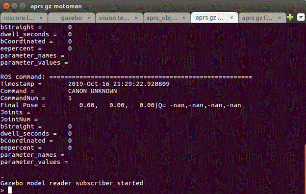
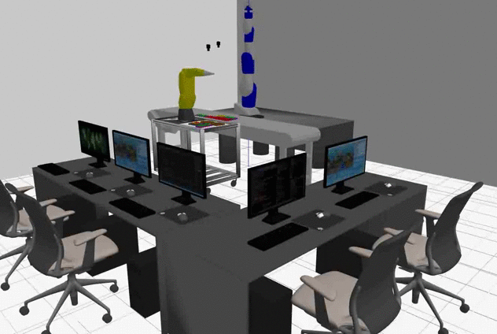

# GZAPRSROS

----

This gives a brief overview of how to install, build and run the gz(Gazebe) aprs (agility performane robot system) ros(robot operating system) code. It is open source with no copyright as it is government work.

# Requirements

Ubuntu and Platforms Tested:

(1)  Ubuntu 16.04.6 LTS

	> lsb_release -a
	No LSB modules are available.
	Distributor ID:	Ubuntu
	Description:	Ubuntu 16.04.6 LTS
	Release:	16.04
	Codename:	xenial
	> uname -a
	Linux 4.4.0-165-generic #193-Ubuntu SMP Tue Sep 17 17:42:52 UTC 2019 x86_64 x86_64 x86_64 GNU/Linux

And Linux installs for:

- Gazebo 9

- Ros I Kinetic

- gnu c++

and if compiling with QT Qt5.9.1 (as Qt 5.5 is VERY BUGGY on Ubuntu 16.04)

From: https://linuxhint.com/install-qt-5-9-1-qt-creator-4-3-1-ubuntu/

	wget http://download.qt.io/official_releases/qt/5.9/5.9.1/qt-opensource-linux-x64-5.9.1.run
	chmod +x qt-opensource-linux-x64-5.9.1.run
	./qt-opensource-linux-x64-5.9.1.run

# Gazebo APRS ROS Build

Navigate to the NIST github site, and clone the gzaprsros repository:

	> git clone https://github.com/usnistgov/gzaprsros.git

You should see the following files and folders:

<TABLE>
<TR>
<TD>File/Folder </TD>
<TD>Description </TD>
</TR>
<TR>
<TD>Install.txt </TD>
<TD>Brief description of installation </TD>
</TR>
<TR>
<TD>InstallScripts </TD>
<TD>Folder containing install scripts for gazebo, ros, etc. </TD>
</TR>
<TR>
<TD>Readme.md </TD>
<TD>Readme you are reading. </TD>
</TR>
<TR>
<TD>Worlds </TD>
<TD>World folder containing iterations on the APRS laboratory setup </TD>
</TR>
<TR>
<TD>bin9 </TD>
<TD>Folder containing canned bash scripts to run agility demos </TD>
</TR>
<TR>
<TD>doc </TD>
<TD>Folder containing documentation </TD>
</TR>
<TR>
<TD>gzaprsros.docx </TD>
<TD>Word document from which Readme.md was generated </TD>
</TR>
<TR>
<TD>gzdatabase </TD>
<TD>Gazebo folder containing models and media definitions </TD>
</TR>
<TR>
<TD>images </TD>
<TD>Image folder for the readme </TD>
</TR>
<TR>
<TD>isvalid.bash </TD>
<TD>Bash script to determine and/or install missing Ubuntu packages. </TD>
</TR>
<TR>
<TD>qtbuild.bash </TD>
<TD>Bash script that uses Qt to build gzaprsros. </TD>
</TR>
<TR>
<TD>rosbuild.bash </TD>
<TD>Bash script that uses ROS catkin_make to build gzaprsros. </TD>
</TR>
<TR>
<TD>src </TD>
<TD>Src folder containing ROS layout of gzaprsros packages </TD>
</TR>
</TABLE>

To build gzaprsros run the bash script:

	> ./rosbuild.bash

Note if all missing packages are automatically installed, except ROS kinetic. If you have a different version of ROS (lunar) then it won't build at this time.

A warning is printed at the top build that you might miss that informs you that the bash script found a duplicate Gazebo installation besides Gazebo9. THIS CAN BE A PROBLEM AND EVERYTHING WILL COMPILE BUT YOU WILL GET A SEGMENTATION FAULT IN GZSERVER.

FYI, there is a circular dependency of headers so one of the packages is run in isolation first, then all the packages are compile with cakint_build.

# RUNNING

APRS Gazebo Execution - TWO OPTIONS mutli-terminal options: (a) (b) and (c)

(a) no gazebo-ros installation. Also attempts to kill any stray gazebo and ros orphan processes (gzserver, gzclient, rosmaster).

   

	a> bin9/agilitydemo.bash

(b) gazebo-ros packages using "ROS launch" for safety system and modbus interaction. Sets up Gazebo and DLL library lookup environment variables before invoking sequence of operations. Also attempts to kill any stray gazebo and ros orphan processes (gzserver, gzclient, rosmaster).

	b> bin9/rosagilitydemo.bash

(c) traditional "ROS launch" but 

	c> cd src
	c> source devel/setup.bash
	c> roslaunch gzrcs gzrcs_demo.launch 

but you must make sure gzserver, ros, etc are not orphans and left running. No pkill in roslaunch. 

runs gazebo as a ROS subsystem to allow rqt, etc. to communicate with Gazebo using ROS communication or services.

# TESTING

We will assume option (a) has been chosen, and you should see this screen:

After running go into the aprs gz Motoman bash command line terminal and type 

	> auto

Likewise go into theaprs gz Fanuc  Fanuc bash command line terminal and type

	> auto

You should see both robot moving gears from trays to kits.

# DEBUGGING 

You can use the QT IDE to do testing debug of the gzrcs application. To do so, first invoke: 

	a> bin9/agilitylab.bash

which starts the rosmaster, and brings up the Gazebo with the world configures as in ./World aprs-lab.world.

Then, start Qt and navigate to the gzrcs.pro file in src/gzrcs. Build the system. And then "debug" the application. Depending on how the Debug command line parameter is set, either the Fanuc (-r fanuc_) or the Motoman (-r motoman_) should be the robot under control. It should read the Config.ini file, connect to the ROS master (running via the agilitylab.bash) and the Gazebo via plugins. You can set breakpoints and control the robot via the command line interface in the pop up console.

