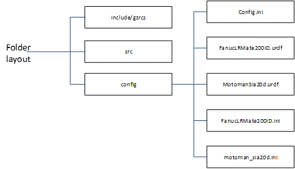

# GZRCS Configuration

GZRCS Configuration.docx

Configuration in the gzrcs application  is bundled under a separate folder "Config" with folder naming and organization as prescribed by ROS node layout: src, include/gzrcs and test as well as the config folder. 

_Figure 1 Folder Layout of gzrcs_

The config folder contains three important types of files.
1. Config.ini file which contains variable assignments of the gzrcs options covered later.  Config.ini file contains the gzrcs configuration information.
2. The config folder also contains a ROS Unified Robot Description Format (URDF) description of the robot.  The URDF description is used to determine the links, joints and parameterization of the robot (e.g., limits). The URDF is used by the abstract layer of the kinematic module for understanding the robot capabilities and limitations.
3. A robot ini file is required by those robots that use the gokin kinematics FK/IK computation module.  For example, the motoman sia20d uses Gokin which requires its own ini file to specify the URDF parameters (instead of Denavit Hartenberg – DH) to configure the forward and inverse kinematics. Gokin solves for the joint angles by solving the linear least squares problem using the pseudo-inverse  of  the  Jacobian . This is done over a number of iterations until the solution converges. If the solution does not converge it is assumed the pose is singular. The gokin iterative approach uses the current robot position as a hint for seeking a convergent solution.    
## Ini File Extensions

The discussed config file is ini format. However, it is not a strict ini compliance – there are no escape characters, by default sections and keys are case sensitive, duplicate keys are allowed, blank lines are allowed, and a few extensions are adopted. The ini format has the typical section and key/value pairs, where keys are assigned values with the equals sign (i.e., '=').   Even though the capability for all the sections and keys to be case insensitive, by default section and parameter names are case sensitive. Values are always case sensitive.
###  Ini File use of Comma Separated Values 

An ini file extension used is the adoption of comma separated values to signify multi-valued keys. Technically, this is not an extension, but internally the ini file code has the facility to read comma separated values (csv) and parse the values into a standard vector. Below is an example to specify the robot(s) and then enumerate options under the robot section key:
	[system]
	robots=  motoman_,fanuc_

And then the motoman_ section details all the options:
	[motoman_]
	longname=MotomanSia20d
	prefix=motoman_
	cycletime = 0.0025
	. . . (more key/value pairs)

Of note, although multiple robots are supported, it was deemed better to only support one robot per application, even though multiple robots and multiple grippers within the Config.ini file have been defined. In the case of multiple definitions, invoking the gzrcs application supports a command line option (i.e. -r) to select the robots parameterization and overrides the selection in the config.ini file. The invocation is shown below:
	gzrcs -r motoman_

Another use of the comma separated values is to define a list of values. Comma separated lists are used extensively to assign multiple values to one key. It is the onus of the programmer to know that a section key has multiple values. Such multi-value keys are used in the following manner:
- define a pose (i.e., 7 values defined as xyz qx qy qz qw),  that are then translated into a ROS tf pose. Quaternion definition in the config.ini file have a leading 'q' to designate the definition of a quaternion. Below are some common transforms (for the base and retract pose transforms, as well as the quaternion for the robot arm bend to reach a gear on a table) in the config.ini file:
	# Transforms
	base= 0.0,0.0,.910,  0.0,0.0,0.0
	retract=0.0,0.0,0.075,0.0,0.0,0.0
	qbend=1.0,0.0,0.0,0.0

It is important to note that transforms can be either 6 or 7 double elements long. By the size the corresponding representation of the tf pose can be determined. For vectors of length 6, the conversion to tf::Pose uses the RPY representation (i.e., roll, pitch, yaw angle rotations in radians). For vectors of length 7, the conversion to tf::Pose uses the Quaternion representation (i.e., qx, qy, qz, qw).
- subbranch definition under current section so that each of these value names has a corresponding key typically to define a pose. Below shows a comma separated list to define the jointmovenames, and then the key/value list to define the 7 joint values for the named motoman joint move. This differs from the robot example earlier, in the csv key values are used as keys in the current section, and not as a separate section.
	# Joint motions
	jointmovenames = Safe,Home,NotHome
	Safe= 1.30, .22, 0.08, 2.26, 3.12, -1.0, -1.28
	Home= 0.0, 0.0, 0.0, 0.0, 0.0, 0.0, 0.0
	NotHome=0.001,0.001,0.001,0.001,0.001,0.001,0.001

- multi-value keys (e.g., finger joint names) for example
	fingernames=robotiq_85_left_finger_tip_link,robotiq_85_right_finger_tip_link
- assigning a section to a key (e.g., robot=motoman_) as discussed earlier.

An especially important key list configuration ini use is for the definition of macros (or a series of commands that are executed). Below shows the homing macro, which instead of going to all zero joint positions corresponding to a kinematic singularity, goes to the "NotHome" named joint move defined previously.  Summarizing, the homing macro is shown below which resets the robot speeds and then moves to the non-singular joint position NotHome.
	# macros
	macros=homing
	homing=reset, goto NotHome

****Important**:** This homing macro is called at the end of the gzrcs configuration and initialization sequence. If you do not move from the all zero joints, the kinematic IK will not work as it cannot handle a singularity.  Each of the macro commands (reset, goto) is defined in the Command Line interpreter.  The actually calling sequence is to internally call the command line interpreter with one command at a time.
###  Ini File use of Concatenation of Multi-value key values

Another ini extension is the use of key values that can be a concatenation of comma separated values by using the plus equal sign (i.e., '+=') to signify do not overwrite, but append the new value to the end of the key value.  Below is an example of   the += operator to build a vector of all the part names. Note, that each line ends with a comma (i.e., ',') because all the gear names are appended to the value, and the value is then turned into a multi-value std vector. S in effect the += operator is merely a convenience operator to simplify building of large or length values.
	# gearing enumeration of part for testing
	parts=sku_kit_s2l2_vessel3,sku_kit_s2l2_vessel4,
	parts+=sku_large_gear_vessel1,sku_large_gear_vessel2,
	parts+=sku_part_large_gear5,sku_part_large_gear6,sku_part_large_gear7,sku_part_large_gear8,
	parts+=sku_part_small_gear9,sku_part_small_gear10,sku_part_small_gear11,sku_part_small_gear12

It is assumed ini format is sufficient, although many prefer a tree style as embodied by YAML. This assertion is incorrect as sections and keys can be formed into tree branches using periods. Finding all the configuration parameters in one file, no matter how large is preferable as text search has been around since after punch cards.

Of note, the homing macro defined in the previous section is defined using the concatenation operator, so that additional commands could be appended if required (e.g., gripper open).
	# macros
	macros=homing
	homing=reset, 
	homing+=goto NotHome


## Ini File Parameterization Description

The ini file is the centralized file for describing the gzrcs options. So, the ini file can contain multiple robots, multiple grippers and then the user can pick and choose among the options. There is no smart GUI for configurating the ini file.  
###  Configuration File Location

The Config folder is copied into the executable folder for both QT implementation and ROS implementation.  This makes configuration file lookup easy, however, installation must be explicit in QT and tricky in ROS catkin_make.

If using QT and qmake, the project file can be programmed to copy the config elements into the executable folder by adding a make install step to the project step. Then the contents of the config folder that are required are copied to the execution folder using the pat/files qmake convention. 
	config_features.path     = "$$OUT_PWD/$$DESTDIR/config"
	config_features.files     = $$PWD/config/Config.ini \
	   $$PWD/config/MotomanSia20d.urdf\
	   $$PWD/config/FanucLRMate200iD.urdf\
	   $$PWD/config/motoman_sia20d.ini
	INSTALLS                  += config_features



Of note, the motoman sia20d uses Gokin which requires its own ini file to configure the forward and inverse kinmetics, and is copied over with this line: $$PWD/config/motoman_sia20d.ini  The urdf files are parse by the kinemtics module, and the Config.ini file contains the gzrcs configuration information.

In ROS using catkin_make a separate custom step is required using CMake to achieve the copy. The catkin_make steps copy to both the ROS install and development executable directories.
	# Gives the config folder files of interest a variable name
	set(CONFIG_SOURCES
	  ${CMAKE_CURRENT_SOURCE_DIR}/config/Config.ini
	  ${CMAKE_CURRENT_SOURCE_DIR}/config/FanucLRMate200iD.urdf
	  ${CMAKE_CURRENT_SOURCE_DIR}/config/MotomanSia20d.urdf
	  ${CMAKE_CURRENT_SOURCE_DIR}/config/FanucLRMate200iD.ini
	  ${CMAKE_CURRENT_SOURCE_DIR}/config/motoman_sia20d.ini
	  )    
	 
	# Copy to the install directory executable folder
	add_custom_command(TARGET ${PROJECT_NAME} POST_BUILD
	                   COMMAND ${CMAKE_COMMAND} -E make_directory ${CMAKE_INSTALL_PREFIX}/${CATKIN_PACKAGE_BIN_DESTINATION}/config/
	                   COMMAND ${CMAKE_COMMAND} -E copy
	                       ${CONFIG_SOURCES}
	                       ${CMAKE_INSTALL_PREFIX}/${CATKIN_PACKAGE_BIN_DESTINATION}/config/
	                   )             
	  
	  
	# Copy to the development directory executable folder
	add_custom_command(TARGET ${PROJECT_NAME} POST_BUILD
	                   COMMAND ${CMAKE_COMMAND} -E make_directory ${CATKIN_DEVEL_PREFIX}/${CATKIN_PACKAGE_BIN_DESTINATION}/config/
	                   COMMAND ${CMAKE_COMMAND} -E copy
	                       ${CONFIG_SOURCES}
	                       ${CATKIN_DEVEL_PREFIX}/${CATKIN_PACKAGE_BIN_DESTINATION}/config/
	                   )             

                   


###  Ini Section Variables

Repeating, it is important to note that ini file transforms can be described using either 6 or 7 double csv  elements. Internally, using the configured csv size the corresponding representation of the tf pose can be determined. For csvof length 6, the conversion to tf::Pose uses the RPY representation (i.e., roll, pitch, yaw angle rotations in radians). For csv of length 7, the conversion to tf::Pose uses the Quaternion representation (i.e., qx, qy, qz, qw).

The following tables describe the ini file configuration for the gzrcs application for the robot simulation. 

The [system] section within the Config.ini file describes global parameters for general robot control and for integration testing with gazebo (CannedDemo).  Due to the erratic behavior of Gazebo grasping there are numerous parameters and grasping strategies –
- dwell time after grasping operation required for one gazebo plugin, 
- flag indicating whether force control is applied during gripping,
- flag indicating whether smart gripper closing is used to center grasp while closing.  


<TABLE>
<TR>
<TD>[system] </TD>
</TR>
<TR>
<TD>Parameter Name </TD>
<TD>Description </TD>
</TR>
<TR>
<TD>name   </TD>
<TD>Name of the application, e.g., NIST Robot Agility Demonsration </TD>
</TR>
<TR>
<TD>robots   </TD>
<TD>robot to command, originally more than one could be controlled. The name MUST include the prefix! e.g., fanuc_ | motoman_ with prefix of underscore </TD>
</TR>
<TR>
<TD>ros </TD>
<TD>Whether ROS is enabled. Flag set to 1 is enabled, set to 0 is disabled. </TD>
</TR>
<TR>
<TD>gazebo </TD>
<TD>Whether Gazebo is enabled. Flag set to 1 is enabled, set to 0 is disabled. </TD>
</TR>
<TR>
<TD>CannedDemo </TD>
<TD>Turn on the canned test demonstration of grasping and moving gears. </TD>
</TR>
<TR>
<TD>WorldCRCLCoordinates </TD>
<TD>Historic- use World coordinates in commands robot goal positions. </TD>
</TR>
<TR>
<TD>GzGearLocations </TD>
<TD>Read gear locations from gazebo plugin for testing of kitting locally not with agility lab. </TD>
</TR>
<TR>
<TD>SmartGripperClosing </TD>
<TD> </TD>
</TR>
<TR>
<TD>RosMasterUrl </TD>
<TD>URL of ROS Master, typically if on same machine, http://localhost:11311 </TD>
</TR>
<TR>
<TD>RosPackageName </TD>
<TD>Package name to give to ROS. Robot name is appended to package name for moderate level of uniqueness. </TD>
</TR>
<TR>
<TD>GzGripperPlugin </TD>
<TD>Gazebo plugin is used to control gripper, not joint values </TD>
</TR>
</TABLE>



The demo section describes some parameter to assist in the CannedDemo or within the DemoAPI for such operations as finding next free gear or open slot.
<TABLE>
<TR>
<TD>[demo] </TD>
</TR>
<TR>
<TD>Parameter Name </TD>
<TD>Description </TD>
</TR>
<TR>
<TD>closest_free </TD>
<TD>Choose the closest free gear to the current robot position from all alternative free gears. </TD>
</TR>
<TR>
<TD>closet_open_slot </TD>
<TD>Choose the closest open slot to the current robot position to place a gear. </TD>
</TR>
<TR>
<TD>smart_speed </TD>
<TD>Use smart speed – which is? </TD>
</TR>
<TR>
<TD>fanuc_.dwell.grasping </TD>
<TD>How long should the Fanuc robot dwell after grasping an object (in seconds). </TD>
</TR>
<TR>
<TD>fanuc_.dwell.time </TD>
<TD>General dwell time between demo primitive motions for the Fanuc robot. </TD>
</TR>
<TR>
<TD>motoman_.dwell.grasping </TD>
<TD>How long should the Motoman robot dwell after grasping an object (in seconds). </TD>
</TR>
<TR>
<TD>motoman_.dwell.time </TD>
<TD>General dwell time between demo primitive motions for the Motoman robot.. </TD>
</TR>
</TABLE>

 



There is the description of the[debug]section in the Config.ini file. The [debug] section describes parameters for debugging and logging configuration.
<TABLE>
<TR>
<TD>[debug] </TD>
</TR>
<TR>
<TD>Parameter Name </TD>
<TD>Description </TD>
</TR>
<TR>
<TD>Log_Robot_Position </TD>
<TD>Log each robot move into Trace.log </TD>
</TR>
<TR>
<TD>Log_Gripper_Status </TD>
<TD>Log gripper status into Trace.log </TD>
</TR>
<TR>
<TD>Debug_World_Command </TD>
<TD>Log controller trajectory interpreter debugging information </TD>
</TR>
<TR>
<TD>Debug_IKFAST </TD>
<TD>Debug ik fast kinematics </TD>
</TR>
<TR>
<TD>Log_Robot_Config </TD>
<TD>Logs the configuration read from the Config.ini file </TD>
</TR>
<TR>
<TD>Log_Cyclic_Robot_Position </TD>
<TD>Log robot position each cycle that is different from last position </TD>
</TR>
<TR>
<TD>LogRobotCrcl </TD>
<TD>Log CRCL commands that arrive excluding status requests </TD>
</TR>
<TR>
<TD>DebugLevel </TD>
<TD>Debug level from (0..5) with 0 only fatal messages logged. </TD>
</TR>
<TR>
<TD>Timestamping </TD>
<TD>Timestamping log message 1 yes timestamp, 0 no. Default yes. </TD>
</TR>
<TR>
<TD>LogConsole </TD>
<TD>Echo logged messages to console, 1=yes, 0=no. Default yes. </TD>
</TR>
<TR>
<TD>symbols = [list of symbols] </TD>
<TD>These are variables that will cause a debugger  break point when accessed. Useful within a debugger. Requires variable to be a preprocessor VAR definition. </TD>
</TR>
</TABLE>




<TABLE>
<TR>
<TD>[CRCL] </TD>
</TR>
<TR>
<TD>Name </TD>
<TD>Section describing CRCL specific configuration </TD>
</TR>
<TR>
<TD>length_units </TD>
<TD>Length units: METER, MM, or INCH </TD>
</TR>
<TR>
<TD>angle_units </TD>
<TD>Angle units: DEGREE or RADIAN </TD>
</TR>
<TR>
<TD>DebugStatusMsg </TD>
<TD>Print out debug information for CRCL status message </TD>
</TR>
<TR>
<TD>DebugCommandMsg </TD>
<TD>Print out debug information for CRCL command message </TD>
</TR>
<TR>
<TD>StopIgnore </TD>
<TD>Ignore STOP command as Will Shakleford uses this before every jog. </TD>
</TR>
<TR>
<TD>DebugXML </TD>
<TD>Print out debug information XML socket. </TD>
</TR>
<TR>
<TD>StopIgnore </TD>
<TD>Ignore stops as APRS framework uses priority queue to handle STOP with command id numbering convention. </TD>
</TR>
<TR>
<TD>flywheel </TD>
<TD>Process all CRCL messages until queue is empty. </TD>
</TR>
<TR>
<TD>processAllCrclMessages </TD>
<TD>Don't ignore some local non-motion CRCL commands, instead take a complete command cycle after being pushed on the motion queue to handle. </TD>
</TR>
</TABLE>

The gazebo related configuration parameters.
<TABLE>
<TR>
<TD>[gazebo] </TD>
</TR>
<TR>
<TD>longname </TD>
<TD>Long name for identification only, e.g., MotomanSia20d </TD>
</TR>
<TR>
<TD>prefix </TD>
<TD>Prefix used for urdf information, e.g., motoman_  </TD>
</TR>
</TABLE>
<TABLE>
<TR>
<TD>modeltopicname </TD>
<TD>Gazebo communication topic name that model information is published. Uses gazebo model message format. </TD>
</TR>
<TR>
<TD>fanuc_.gzJointPrefix </TD>
<TD>Joint prefix to use when setting Fanuc robot joint </TD>
</TR>
<TR>
<TD>fanuc_.gzLeftFingerContactTopic </TD>
<TD>Fanuc robot left finger contact topic when contact sensor enabled in world model  for left finger. </TD>
</TR>
<TR>
<TD>fanuc_.gzRightFingerContactTopic </TD>
<TD>Fanuc robot right finger contact topic when contact sensor enabled in world model  for right finger.. </TD>
</TR>
<TR>
<TD>fanuc_.gzRobotCmdTopicName </TD>
<TD>Fanuc topic for robot joint plugin  commanding robot joints </TD>
</TR>
<TR>
<TD>fanuc_.gzRobotStatusTopicName </TD>
<TD>Fanuc topic for robot joint plugin  reading status of robot joints </TD>
</TR>
<TR>
<TD>fanuc_.gzGripperCmdTopicName </TD>
<TD>Fanuc topic name for gripper plugin command  </TD>
</TR>
<TR>
<TD>fanuc_.gzGripperStatusTopicName </TD>
<TD>Fanuc topic name for gripper plugin status  </TD>
</TR>
<TR>
<TD>motoman_.gzJointPrefix </TD>
<TD>Joint prefix to use when setting Motoman robot joint </TD>
</TR>
<TR>
<TD>motoman_.gzLeftFingerContactTopic </TD>
<TD>Motoman robot left finger contact topic when contact sensor enabled in world model  for left finger. </TD>
</TR>
<TR>
<TD>motoman_.gzRightFingerContactTopic </TD>
<TD>Motoman robot right finger contact topic when contact sensor enabled in world model  for right finger.. </TD>
</TR>
<TR>
<TD>motoman_.gzGripperCmdTopicName </TD>
<TD>Motoman topic name for gripper plugin command  </TD>
</TR>
<TR>
<TD>motoman_.gzGripperStatusTopicName </TD>
<TD>Motoman topic name for gripper plugin status  </TD>
</TR>
<TR>
<TD>motoman_.gzRobotCmdTopicName </TD>
<TD>Motoman topic for robot joint plugin  commanding robot joints </TD>
</TR>
<TR>
<TD>motoman_.gzRobotStatusTopicName </TD>
<TD>Motoman topic for robot joint plugin  reading status of robot joints </TD>
</TR>
</TABLE>





Next comes the robot specification given as the name assigned as the value to [system] robots parameter. Each robot instance should define the following parameters (or use the default assigned internal to the executing program.) Note that the section name includes the underscore.
<TABLE>
<TR>
<TD>[motoman_] </TD>
</TR>
<TR>
<TD>crcl.Ip </TD>
<TD>IP/Host name of CRCL handler, assuming handler is ROS node. Should always be local host, i.e., 127.0.0.1 </TD>
</TR>
<TR>
<TD>crcl.Port </TD>
<TD>CRCL port to listen for connecting clients. For motoman, port = 64445 </TD>
</TR>
<TR>
<TD>crcl.PublishStatusPeriod </TD>
<TD>CRCL publishing rate to listener in seconds. E.g., 0.05 is 50 millisecond (approximate) between updates to listening CRCL handler. </TD>
</TR>
<TR>
<TD>finger_contact_topic </TD>
<TD>/gazebo/default/sia20d/motoman_sia20d/motoman_robotiq_85_left_finger_tip_link/left_finger_contact, </TD>
</TR>
<TR>
<TD>finger_contact_topic+ </TD>
<TD>/gazebo/default/sia20d/motoman_sia20d/motoman_robotiq_85_right_finger_tip_link/right_finger_contact </TD>
</TR>
<TR>
<TD>gear.large.gripperoffset  </TD>
<TD> </TD>
</TR>
<TR>
<TD>gear.medium.gripperoffset  </TD>
<TD> </TD>
</TR>
<TR>
<TD>gear.small.gripperoffset  </TD>
<TD> </TD>
</TR>
<TR>
<TD>joints.Home </TD>
<TD>0.0, 0.0, 0.0, 0.0, 0.0, 0.0, 0.0 </TD>
</TR>
<TR>
<TD>joints.movenames  </TD>
<TD>Named joint moves as commas separated list. Note, for motoman "home" is joints at all zero which is singularity and causes problems with IK. Thus a nothome was defined. E.g., jointmovenames = Safe,Home,NotHome </TD>
</TR>
<TR>
<TD>joints.NotHome </TD>
<TD>0.001,0.001,0.001,0.001,0.001,0.001,0.001 </TD>
</TR>
<TR>
<TD>kinsolver </TD>
<TD>Name of the kinematic solver. At one time there was ikfast, track-ik and gokin. Now only gokin which is given by, GoMotoKin </TD>
</TR>
<TR>
<TD>nc.cycletime  </TD>
<TD>Cycle time of robot control cycle in seconds. E.g., 0.01 is 10 millisecond duty cycle. </TD>
</TR>
<TR>
<TD>nc.traj </TD>
<TD>Trajectory generator selection. Now only "Go" can be used. BangBang and others have been removed. </TD>
</TR>
<TR>
<TD>parts </TD>
<TD>List of part names that will be included in this section for  </TD>
</TR>
<TR>
<TD>parts.transform </TD>
<TD> </TD>
</TR>
<TR>
<TD>parts+ </TD>
<TD> </TD>
</TR>
<TR>
<TD>parts+ </TD>
<TD> </TD>
</TR>
<TR>
<TD>parts+ </TD>
<TD> </TD>
</TR>
<TR>
<TD>rate.linearmax </TD>
<TD>Trajectory linear motion maximum e.g., 1.0, 10.0, 100.0 </TD>
</TR>
<TR>
<TD>rate.rotationmax </TD>
<TD>Trajector rotation motion vel/zcc/jerk maximum, e.g., .1, 1.0, 10.0 </TD>
</TR>
<TR>
<TD>robot.baselink </TD>
<TD>Name of base link for robot for parsing URDF. </TD>
</TR>
<TR>
<TD>robot.eelink </TD>
<TD>Name of end effector link for robot for parsing URDF. </TD>
</TR>
<TR>
<TD>robot.gripper </TD>
<TD>Type of gripper. Value refers to another section in Config.ini file. </TD>
</TR>
<TR>
<TD>robot.longname </TD>
<TD>Long name for identification only, e.g., MotomanSia20d </TD>
</TR>
<TR>
<TD>robot.prefix </TD>
<TD>Prefix used for urdf information, e.g., motoman_  </TD>
</TR>
<TR>
<TD>xform.base </TD>
<TD>Transform (xyz quaternion) apply from origin to get to robot base frame </TD>
</TR>
<TR>
<TD>xform.bend </TD>
<TD>Quaternion representation of robot bend to reach gears (used in canned demo and other grasping command line interface). </TD>
</TR>
<TR>
<TD>xform.retract </TD>
<TD>Parameter to describe retract transform from grasping goal pose </TD>
</TR>
</TABLE>





There are sections for the various grippers used. The following is based on the  Motoman gripper in agility lab. It was developed by Peter Mnev 
<TABLE>
<TR>
<TD>[gripper parameters] </TD>
</TR>
<TR>
<TD>correction </TD>
<TD>Correction transform to apply to each pose IK calculation. Generally errors are based on different grippers, so each gripper incorporates this transform, and if no eror, can be identify transform. </TD>
</TR>
<TR>
<TD>gripperJoints </TD>
<TD>Name of the finger joints, e.g., left_finger_joint,right_finger_joint. </TD>
</TR>
<TR>
<TD>gripperOpen </TD>
<TD>Joint values when gripper closed. E.g., -0.03, 0.03 </TD>
</TR>
<TR>
<TD>gripperClose </TD>
<TD>Joint values when fingers closed, e.g., -0.0023, 0.0023 </TD>
</TR>
<TR>
<TD>gripperSafeclose </TD>
<TD>Joint values for safe close </TD>
</TR>
<TR>
<TD>gripperHardclose </TD>
<TD>Joint values for hard close </TD>
</TR>
<TR>
<TD>gripperMultiplier </TD>
<TD>Direction each finger moves when closing </TD>
</TR>
<TR>
<TD>tool </TD>
<TD>Transform to describe the mapping from the origin of the gripper to its end pose. E.g., 0.008, 0.000, .2643, 0.0,0.0,0.0 </TD>
</TR>
<TR>
<TD> </TD>
<TD> </TD>
</TR>
<TR>
<TD>fingernames </TD>
<TD>Link names of the fingers, found in urdf or SDF e.g.,  motoman_Finger1,motoman_Finger2 </TD>
</TR>
<TR>
<TD>finger_increment </TD>
<TD>Increment to apply when closing gripper that is small enough so that contact of finger tip can be detected e.g., -0.00001,-0.00001 </TD>
</TR>
<TR>
<TD>fingerjoints.motoman_left_finger </TD>
<TD>List of joints for left finger. Some grippers have more than one joint per finger. </TD>
</TR>
<TR>
<TD>fingerjoints.motoman_right_finger </TD>
<TD> </TD>
</TR>
<TR>
<TD>fingerContactAmount </TD>
<TD>Amount of contact that will trigger a contact state between a finger and an object. Basically, this is the maximum collision amount between the object and the finger. Units are meters. </TD>
</TR>
<TR>
<TD>fingerExtaSqueeze </TD>
<TD>Amount of "squeeze" applied after gripper has initiated contact from both sides. IGNORED. </TD>
</TR>
<TR>
<TD> </TD>
<TD> </TD>
</TR>
</TABLE>