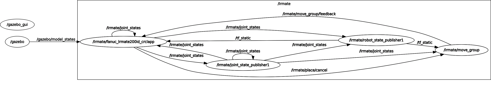

Below is the rqt_graph of the crcl2ros system. The oval diagrams indicate a ROS node or process. THye arrow lines between processes indicate a communication topic and the arrow end indicates the listener. Note the architecture elements are grouped in a namespace called "lrmate". The namespace helps distinguish reoccurring ROS params and nodes with unique identification. 

The major components in the CRCL2ROS workspace are as follows:

- Gazebo – gui client and physics server. In the Gazebo server, the model topic is read to determine the current knowledge about the kitting models (i.e., trays and gears).

- Move_group – is a reduced footprint instance of moveit!. It is used for kinematic solving (using the designated plugin) and for Cartesian trajectory generation. 

- joint_state_publisher1 is the joint_state_publisher ROS node that accepts joint values on the /crc/joint_states topic and then publishes these joint values to robot_state_publisher (which translates the joint values into Cartesian link transforms) and move_group.

- robot_state_publisher1 is the robot_state_publisher ROS node which accepts joint values and computes the 0T6 transforms for each link.

- fanuc_lrmate200id_crclapp is the primary CRCL streaming node which accepts CRCL command and reports CRCL status. Inside, each CRCL command is translated into ROS move_group representation which is then used to compute the trajectory and inverse kinematics for Cartesian moves. 





