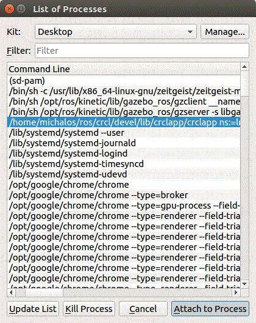
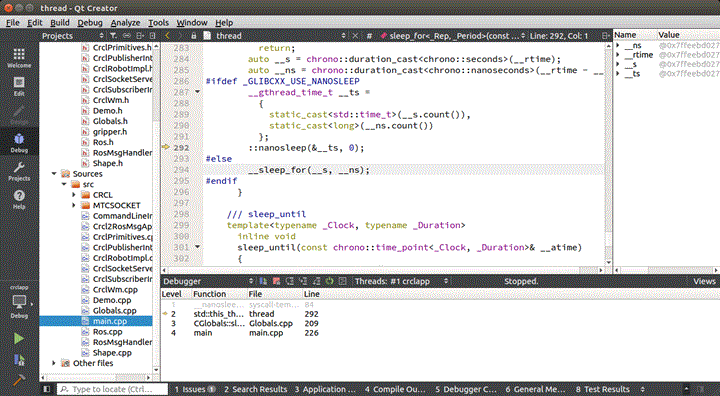
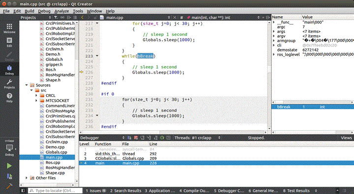
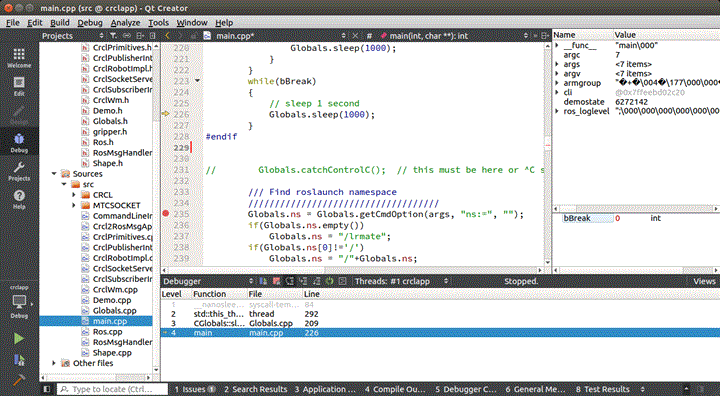

## Q: QT IDE Doesn't seem to work with namespace moveit, can I attach with QT Debugger?

Yes. If you modify the ptrace flag in Linux. From [<u>here</u>](https://doc.qt.io/qtcreator/creator-troubleshooting-debugging.html) :

"Debugger Cannot Attach to Running Process on Linux"

GDB uses ptrace to attach to running processes. Some Linux distributions do not allow this, which stops all attempts to either directly attach to an existing process or use the Run in terminal option in Qt Creator. ... However, the usefulness of this security measure seems dubious, because this feature can be easily disabled. 

With root permissions, you MUST disable the feature temporarily by writing 0 into /proc/sys/kernel/yama/ptrace_scope or permanently by changing the value in /etc/sysctl.d/10-ptrace.conf. Even if you do not have elevated permissions, you can disable the feature later by adding a library that calls prctl(0x59616d61, getppid(), 0, 0, 0);, such as the one in $QTCREATORDIR/lib/libptracepreload.so to the LD_PRELOAD environment.

I got it to work (attached QT IDE after the roslaunch):

	2012  cd /etc/sysctl.d
	2014  more 10-ptrace.conf
	2016  sudo vi 10-ptrace.conf 
	(Using vi: scroll down, del 1, hit i then 0 hit esc then :w then :q) 
	2017  more 10-ptrace.conf 

And it worked. 

Then I added a break flag for the process to loop before QT was attached to it.  Make sure you do a "catkin build" with debug flags so you have debug symbols:

	catkin build -DCMAKE_BUILD_TYPE=Debug 

which sets the Gnu G++ -g option for compiling with CMake.

A sleep loop was put in the start of the debugged program to wait for QT IDE to attach (and it helped from clobbering a not ready Gazebo.)

There were numerous options to handle passing in a variable. We will go over what is embedded in the crcl2ros code.

Embedded in the crcl2ros code is the addition of a variable that is read in QT from the roslaunch<node> command line that can be modified by the debugger (and by default set to '0') or if '1' modify the variable to 0 to fall out of the loop. 

	// This is a command arg "qtbreak:=1" from roslaunch.  
	bool bBreak = Globals.convert<int>(Globals.getCmdOption(args, "qtbreak:=", "0"));
 
	while(!bBreak)
	{        
  		Globals.sleep(1000); 
	} 

To attach the ROS running program stuck in this loop, first attach the executable:

	Menu: Debug->Start Debugging -> Attach to Running Application 

And then choose your rosnode exe name.  In the dialog below /home/michalos/ros/crcl/devel/lib/crclapp €¦.

You will start within the while loop suspended, in the sleep method.

You can now modify the bBreak variable in QT to continue running with breakpoints, etc. enabled to be triggered. First change the calling stack Function to main:

To modify the bBreak variable, first right click on the bBreak variable and "Add Expression"  and change the value from 1 to 0:

Now you can single step or if you have breakpoints stop at them with run.

There are other options to passing and modifying the break flag. For example, this code allow QT IDE to attach to process and stop if a ros param has been set.

	ros::param::set("/bBreak", bBreak);
	while(bBreak)
	{
		// sleep 1 second
		Globals.sleep(1000);
		ros::param::get("/bBreak", bBreak);
	}

If you prefer to use the ros param method, you  need to source your ROS workspace and then ros param command lilne app to change the bBreak flag:

	"cd ROS workspace" 
	source devel/setup.bash 
	rosparam set /bBreak 1  

If you use the ros param you will have to initialize ROS before reading the break Ros param.

