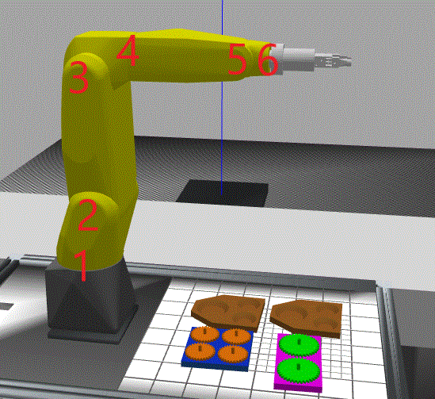









# Table of Contents



  0.1 [Q:  Where can I find some code snippets to do motion planning with moveit (kinetic)?](#Q:__Where_can_I_find_some_code_snippets_to_do_motion_planning_with_moveit_(kinetic)?)

  0.2 [Q: How come I don't see any debug diagnostic output coming from a ros node?](#Q:_How_come_I_don't_see_any_debug_diagnostic_output_coming_from_a_ros_node?)

  0.3 [Q: On longer trajectory paths it appears as if the moveit trajectory overshoots. What gives?](#Q:_On_longer_trajectory_paths_it_appears_as_if_the_moveit_trajectory_overshoots._What_gives?)

  0.4 [Q:  Where can I find some documentation on moveit online? (ROS1)](#Q:__Where_can_I_find_some_documentation_on_moveit_online?_(ROS1))

  0.5 [Q: Is there a conceptual breakdown of moveit with pictures?](#Q:_Is_there_a_conceptual_breakdown_of_moveit_with_pictures?)

  0.6 [Q: How do I verify the URDF is valid?](#Q:_How_do_I_verify_the_URDF_is_valid?)

  0.7 [Q: Can I use rosservice to get the properties of a joint from Gazebo, including the current position?](#Q:_Can_I_use_rosservice_to_get_the_properties_of_a_joint_from_Gazebo,_including_the_current_position?)

  0.8 [Q: How do I use rqt to control the ROS robot in a gazebo simulation?](#Q:_How_do_I_use_rqt_to_control_the_ROS_robot_in_a_gazebo_simulation?)

  0.9 [Q: Can I prevent the kinematic IK solver from flopping up and down with IKfast?](#Q:_Can_I_prevent_the_kinematic_IK_solver_from_flopping_up_and_down_with_IKfast?)

  0.10 [Q: How do I use urdf in roslaunch?](#Q:_How_do_I_use_urdf_in_roslaunch?)

  0.11 [Q: Can I set joint values in gazebo using ROS api plugin?](#Q:_Can_I_set_joint_values_in_gazebo_using_ROS_api_plugin?)

  0.12 [Q: How do I convert ROS URDF into Gazebo SDF?](#Q:_How_do_I_convert_ROS_URDF_into_Gazebo_SDF?)

  0.13 [Q: How do I convert Gazebo SDF into ROS URDF?](#Q:_How_do_I_convert_Gazebo_SDF_into_ROS_URDF?)

  0.14 [Q: How come Gazebo won't respond to any joint position commands?](#Q:_How_come_Gazebo_won't_respond_to_any_joint_position_commands?)

  0.15 [Q: Can I rename my URDF robot from XXX to YYY? What changes do I have to make?](#Q:_Can_I_rename_my_URDF_robot_from_XXX_to_YYY?_What_changes_do_I_have_to_make?)

  0.16 [Q: I want to spawn robots in different locations in the world. Can I do this? What is the effect](#Q:_I_want_to_spawn_robots_in_different_locations_in_the_world._Can_I_do_this?_What_is_the_effect)

  0.17 [Q: Can I use gazebo_ros_api plugin on the Gazebo command line in roslaunch like I can when I invoke gazebo from the command line?](#Q:_Can_I_use_gazebo_ros_api_plugin_on_the_Gazebo_command_line_in_roslaunch_like_I_can_when_I_invoke_gazebo_from_the_command_line?)

  0.18 [Q: How to handle multiple URDF files in a single moveit package](#Q:_How_to_handle_multiple_URDF_files_in_a_single_moveit_package)

  0.19 [Q: Where can I find documentation on moveit assistant?](#Q:_Where_can_I_find_documentation_on_moveit_assistant?)

  0.20 [Q: More on robot model](#Q:_More_on_robot_model)

  0.21 [Q: How do I handle Multi-robot controller-manager for different robot_description?](#Q:_How_do_I_handle_Multi-robot_controller-manager_for_different_robot_description?)

  0.22 [Q: What about Robot model parameter not found](#Q:_What_about_Robot_model_parameter_not_found)

  0.23 [Q: Is there an environmental variable for current namespace in launch files?](#Q:_Is_there_an_environmental_variable_for_current_namespace_in_launch_files?)

  0.24 [Q: Where is some documentation on Robot Model and Robot State](#Q:_Where_is_some_documentation_on_Robot_Model_and_Robot_State)

  0.25 [Q: How can I run multiple move_group for different robots in single system?](#Q:_How_can_I_run_multiple_move_group_for_different_robots_in_single_system?)

  0.26 [Q: What is the difference between param vs rosparam?](#Q:_What_is_the_difference_between_param_vs_rosparam?)

  0.27 [Q: Do you have a Basic Grammar of ROS Launch?](#Q:_Do_you_have_a_Basic_Grammar_of_ROS_Launch?)

  0.28 [Q: Passing arg to rosrun](#Q:_Passing_arg_to_rosrun)

  0.29 [Q: Where are the OSRF ARIAC Code repositories found?[<u>here</u>](https://bitbucket.org/osrf/ariac/wiki/browse/)](#Q:_Where_are_the_OSRF_ARIAC_Code_repositories_found?[<u>here</u>](https://bitbucket.org/osrf/ariac/wiki/browse/))

  0.30 [Q: Can I forward the joint states to another topic (e.g., that which has a ns attribute)](#Q:_Can_I_forward_the_joint_states_to_another_topic_(e.g.,_that_which_has_a_ns_attribute))

  0.31 [Q: How do I get the ROS namespace that the C++ package was spawned?Programmatically get node's Namespace: [<u>here</u>](https://answers.ros.org/question/62620/programmatically-get-nodes-namespace/)](#Q:_How_do_I_get_the_ROS_namespace_that_the_C++_package_was_spawned?Programmatically_get_node's_Namespace:_[<u>here</u>](https://answers.ros.org/question/62620/programmatically-get-nodes-namespace/))

  0.32 [Q: How do I "find" a package in a rosrun argument?](#Q:_How_do_I_"find"_a_package_in_a_rosrun_argument?)

  0.33 [Q: Getting rosparam from node namespace within bash script?](#Q:_Getting_rosparam_from_node_namespace_within_bash_script?)

  0.34 [Q: Can I check if my roslaunch is valid?](#Q:_Can_I_check_if_my_roslaunch_is_valid?)

  0.35 [Q: How do I set an environment variable in roslaunch?](#Q:_How_do_I_set_an_environment_variable_in_roslaunch?)

  0.36 [Q: How can I get my cout output on the console when using roslaunch?](#Q:_How_can_I_get_my_cout_output_on_the_console_when_using_roslaunch?)

  0.37 [Q: How do I set a delay between starting nodes within launch file](#Q:_How_do_I_set_a_delay_between_starting_nodes_within_launch_file)

  0.38 [Q: QT IDE Doesn't seem to work with namespace moveit, can I attach with QT Debugger?](#Q:_QT_IDE_Doesn't_seem_to_work_with_namespace_moveit,_can_I_attach_with_QT_Debugger?)

  0.39 [Q: Can I read and modify rosparam ?](#Q:_Can_I_read_and_modify_rosparam_?)

  0.40 [Q: What the difference between private param and global param?](#Q:_What_the_difference_between_private_param_and_global_param?)

  0.41 [Q: How can I pass pose messages for moving arm in a straight line?](#Q:_How_can_I_pass_pose_messages_for_moving_arm_in_a_straight_line?)

  0.42 [Q: Cartesian controller for ROS](#Q:_Cartesian_controller_for_ROS)** 



## Q:  Where can I find some code snippets to do motion planning with moveit (kinetic)?

http://docs.ros.org/en/kinetic/api/moveit_tutorials/html/doc/motion_planning_api/motion_planning_api_tutorial.html

## Q: How come I don't see any debug diagnostic output coming from a ros node?

You need to enable output to the screen in the roslaunch by adding output="screen" argument:

	output="screen" 

I would prefer to send diagnostics output to the log file

	Output="log" 

Of course, this assumes the ROS node supports this notation.

## Q: On longer trajectory paths it appears as if the moveit trajectory overshoots. What gives?

It sounds like a controller issue more than a moveit issue. In the robot's URDF I'd check to see if the <joint> tags have the "effort" property set. I set effort to -1 (no force limits) so that the robot can stop on a dime.

## Q:  Where can I find some documentation on moveit online? (ROS1)

[<u>here</u>](https://moveit.readthedocs.io/en/latest/doc/pr2_tutorials/planning/src/doc/move_group_interface_tutorial.html)

## Q: Is there a conceptual breakdown of moveit with pictures?

[<u>here</u>](https://moveit.ros.org/documentation/concepts/)



## Q: How do I verify the URDF is valid?

A: Make sure the command "checkurdf" is installed. 

	>~/ros/moveittest/src/fanuc_lrmate200id_support/urdf$ checkurdf FanucLRMate200iD.urdf  
	No command 'checkurdf' found, did you mean: 
	 Command 'check_urdf' from package 'liburdfdom-tools' (universe) 
	checkurdf: command not found 
	>~/ros/moveittest/src/fanuc_lrmate200id_support/urdf$ rosrun urdfdom check_urdf FanucLRMate200iD.urdf  
	[rospack] Error: package 'urdfdom' not found 
	 
	sudo apt-get install liburdfdom-tools  

Then you use " check_urdf" to verify the urdf is valid, or roslaunch will barf. Below is a working fanuc urdf:

	> check_urdf lrmate200id.urdf 
	robot name is: fanuc_lrmate200id 
	---------- Successfully Parsed XML --------------- root Link: world has 1 child(ren) 
	     child(1):  fanuc_base_link 
	         child(1):  fanuc_link_1 
	             child(1):  fanuc_link_2 
	                 child(1):  fanuc_link_3 
	                     child(1):  fanuc_link_4 
	                         child(1):  fanuc_link_5 
	                             child(1):  fanuc_link_6 
	                                 child(1):  fanuc_finger_1 
	                                 child(2):  fanuc_finger_2 

## Q: Can I use rosservice to get the properties of a joint from Gazebo, including the current position?

A: Yes.  You need to query the model name ( fanuc_lrmate200id) and the joint name ( fanuc_joint_1) as described in the URDF and as shown below:

	> rosservice call /gazebo/get_joint_properties "fanuc_lrmate200id::fanuc_joint_1" 
	type: 0 
	damping: [] 
	position: [-1.0302869668521453e-13] 
	rate: [2.049300806658447e-20] 
	success: True 
	status_message: "GetJointProperties: got properties" 
	 
	Current pose 
	position:  
	  x: 0.464905 
	  y: 0 
	  z: 0.695066 
	orientation:  
	  x: 0 
	  y: -7.95692e-05 
	  z: 0 
	  w: 1 
	 
	Goal pose 
	position:  
	  x: 0.4 
	  y: -0.06 
	  z: 0.05 
	orientation:  
	  x: 0 
	  y: 0.707107 
	  z: 0 
	  w: 0.707107 
	 



Since service calls are blocking, it will return once the call is done. Of course each service call could invoke a thread so its asynchronous under the hood.



## Q: How do I use rqt to control the ROS robot in a gazebo simulation?

	Install rqt plugin: [<u>here</u>](http://wiki.ros.org/rqt_joint_trajectory_controller).  
	> sudo apt-get install ros-kinetic-joint-trajectory-controller 
	 
	> rosrun rqt_graph rqt_graph> rosrun rqt_gui rqt_gui 
	 





## Q: Can I prevent the kinematic IK solver from flopping up and down with IKfast?

A: If you narrow the joint limits you should prevent flopping but may get other problems. This narrow of joint limits seem to work for UR10 and Fanuc robots.

	I've only thoroughly tested joint limits for the UR10, but I think a good choice for the Fanuc would be [-pi/2, pi/2] for joint 1 and [-pi/2, pi/2] for joint 4 (assuming joints are numbered 1-6) to keep the elbow from flipping over. The rest of the joints probably don't need any extra limits. 

 

## Q: How do I use urdf in roslaunch?

Using xacro in roslaunch



	<param  name="robot_description" command="$(find xacro)/xacro --inorder '$(find rospkg)/urdf/myrobot.xacro'" /> 
	 

using urdf file in roslaunch

	<param name="robot_description" textfile="$(arg package)/urdf/myrobot.urdf" /> 





## Q: Can I set joint values in gazebo using ROS api plugin?

Using the gazebo_ros_api gazebo_msgs::SetModelConfiguration plugin you can set all the Gazebo robot joints at once. 

	#include "ros/service_client.h" 
	. . . 
	ros::ServiceClient _gzSetJntTraj; /**< gazebo ros api plugin service */ 

Now, we need to inform ROS that we will be using the gazebo_msgs::SetModelConfiguration service, by creating a service topic:

	 
	_gzSetJntTraj= 
	nh->serviceClient<gazebo_msgs::SetModelConfiguration>("/gazebo/set_model_configuration"); 

To start with, we will assume a moveit trajectory has been defined with multiple  waypoints in joint-space. 

	  // We assume a moveit trajectory 
	  moveit_msgs::RobotTrajectory trajectory 
	 
	  // That will be decomposed into JointTrajectoyPoint from 1 .. n 
	  trajectory_msgs::JointTrajectoryPoint pt; 
	 
	  for(size_t i=0; i< trajectory.joint_trajectory.points.size();++i) 
	  { 
	    pt = trajectory.joint_trajectory.points[i]; 



Next, we will send a series of joint-space requests to gazebo_ros_api SetModelConfiguration service. Each request contains one of the joint-space moveit trajectory points. To make this work, we assume our robot model is named fanuc_lrmate200id and we have the joint names matching the URDF or SDF joint names.  

	#include <gazebo_msgs/SetModelConfiguration.h> 
	. . .  
	 
	 // declare gazebo_ros_api service message 
	 gazebo_msgs::SetModelConfiguration traj; 
	 
	 // fill in the request element 
	 traj.request.model_name="lrmate";  /// robot name 
	 traj.request.urdf_param_name=""; 
	 // Joint names use the URDF joint names with the robot name preceding. 
	 traj.request.joint_names=this->joint_names; 
	 for(size_t k=0; k< joint_names.size(); k++)   traj.request.joint_names[k]= "fanuc_lrmate200id::" + 
	                               traj.request.joint_names[k]; // Now load in the joint positions 
	 for(size_t k=0; k<pt.positions.size(); ++k)   traj.request.joint_positions.push_back( 
	trajectory.joint_trajectory.points[i].positions[k]); 
	 
	  // Note this is a synchronous call unless the service returns immediately 
	  if (!_gzSetJntTraj.call(traj)) 
	      ROS_ERROR("Failed to call service /gazebo/set_model_configuration\n"); 

It is important to get the naming scheme correct (robot ns+joint name) based on the Gazebo model, as if you mess up the naming scheme (which is easy to do as there is no error message?), the Gazebo robot will not move. And it's a bummer to debug.



Here is my breakdown of the names. The  traj.request.model_name  which is "lrmate" came from the World.sdf file, which loaded the fanuc robot:

	<!-- Fanuc Robot --> 
	<model name="lrmate"> 
	   <include> 
	      <static>false</static> 
	      <uri>model://fanuc_lrmate200id</uri> 
	      <pose>-0.169 -1.140 0.934191 0 0 0</pose> 
	   </include> 
	   <plugin name="GZParallelGripperPlugin" filename="libgzparallelgripperplugin.so"> 
	. . . 
	   </plugin> 
	</model> 



While the joint model qualifier comes from:

The Fanuc in the world.sdf is defined by this Gazebo model definition

	<uri>model://fanuc_lrmate200id</uri> 

The model://fanuc_lrmate200id has the following SDF/XML file definition, with the joints and visuals defined within this file:

	<?xml version="1.0" encoding="UTF-8"?> 
	<sdf version="1.6"> 
	     <model name="fanuc_lrmate200id"> 
	. . . 

Yes, I'm a bit confused. 

## Q: How do I convert ROS URDF into Gazebo SDF?

A: This worked at one time. As with all ROS stuff, ages like bad wine.

	gz sdf --print sia20d.urdf > sia20d.sdf 
	 
	# Start gazebo 
	$ gazebo 
	 
	# Open another terminal, and spawn the model 
	$ gz model --spawn-file=sia20d.sdf --model-name=motoman_sia20d 
	 
	 
	gzsdf print sia20d.urdf 

## Q: How do I convert Gazebo SDF into ROS URDF? 

A: PYSDF ([<u>here</u>](https://gcc02.safelinks.protection.outlook.com/?url=http%3A%2F%2Fwiki.ros.org%2Fpysdf&data=04%7C01%7Cjohn.michaloski%40nist.gov%7C2eef1fafbd07434ebe3908d8837e8591%7C2ab5d82fd8fa4797a93e054655c61dec%7C1%7C0%7C637403926715688230%7CUnknown%7CTWFpbGZsb3d8eyJWIjoiMC4wLjAwMDAiLCJQIjoiV2luMzIiLCJBTiI6Ik1haWwiLCJXVCI6Mn0%3D%7C1000&sdata=laiQ2LIe3tmsDcfYg9jKrkg%2FPOQlmOdaPE0u8nNCU54%3D&reserved=0))! It more or less works with little fanfare, but is very helpful. Of note, it says you can use gazebo_ros_api plugin to load sdf instead of urdf, but I have not tried. (On hindsight might have been easier).

	sdf2urdf.py [-p plotfile.png] model.sdf model.urdf uses the pysdf  
	library to convert a SDF model to a URDF model (and optionally plot the  
	SDF model). Hierarchical SDF models (<include>) are supported. URDF can  
	only express a subset of SDF models, therefore the conversion will only  
	result in a valid URDF (use check_urdf), if the SDF is within this  
	subset - i.e. there is a unique root link. 



Pysdf works TG. Issues but gets you close, and I was able to use.

	>~/ros/pysdf$ catkin_make 
	Base path: /home/michalos/ros/pysdf 
	Source space: /home/michalos/ros/pysdf/src Build space: /home/michalos/ros/pysdf/build Devel space: /home/michalos/ros/pysdf/devel Install space: /home/michalos/ros/pysdf/install #### #### Running command: "make cmake_check_build_system" in "/home/michalos/ros/pysdf/build" 
	#### 
	#### 
	#### Running command: "make -j4 -l4" in "/home/michalos/ros/pysdf/build" 
	#### 
	>~/ros/pysdf$ ./runpysdf.bash [rospack] Error: package 'pysdf' not found >~/ros/pysdf$ source devel/setup.bash >~/ros/pysdf$ ./runpysdf.bash Model( 
	   name: fanuc_lrmate200id 
	   pose: t=[0. 0. 0.] q=[0. 0. 0. 1.] 
	   pose_world: t=[0. 0. 0.] q=[0. 0. 0. 1.] 
	   version: 1.6 
	   root_link: world 
	   links: 
	     Link( 
	       name: world 
	       pose: t=[0. 0. 0.] q=[0. 0. 0. 1.] 
	       pose_world: t=[0. 0. 0.] q=[0. 0. 0. 1.] 
	       inertial: Inertial( 
	         pose: t=[0. 0. 0.] q=[0. 0. 0. 1.] 
	         mass: 0 
	         inertia: Inertia(ixx=0, ixy=0, ixz=0, iyy=0, iyz=0, izz=0) 
	       ) 
	       collisions: [ 
	 
	       ] 
	       visuals: [ 
	 
	       ] 
	     ) 
	     Link( 
	       name: link0 
	       pose: t=[0. 0. 0.] q=[0. 0. 0. 1.] 
	       pose_world: t=[0. 0. 0.] q=[0. 0. 0. 1.] 
	       inertial: Inertial( 
	         pose: t=[0. 0. 0.] q=[0. 0. 0. 1.] 
	         mass: 4 
	         inertia: Inertia(ixx=0.0216667, ixy=0, ixz=0, iyy=0.0216667, iyz=0, izz=0.0240667) 
	       ) 
	       collisions: [ 
	         Collision(name:  
	link0_fixed_joint_lump__fanuc_base_link_collision, pose: t=[0. 0. 0.] q=[0. 0. 0. 1.], pose_world: t=[0. 0. 0.] q=[0. 0. 0. 1.], 
	geometry_type: mesh, geometry_data: {'scale': '1 1 1', 'uri':  
	'model://fanuc_lrmate200id/meshes/lrmate200id/visual/base_link.stl'}) 
	       ] 
	       visuals: [ 
	         Visual(name: link0_fixed_joint_lump__fanuc_base_link_visual, 
	pose: t=[0. 0. 0.] q=[0. 0. 0. 1.], pose_world: t=[0. 0. 0.] q=[0. 0. 0.  
	1.], geometry_type: mesh, geometry_data: {'scale': '1 1 1', 'uri':  
	'model://fanuc_lrmate200id/meshes/lrmate200id/visual/base_link.stl'}) 
	       ] 
	     ) 

This continues for the joints. . .

	   joints: 
	     Joint( 
	       name: world_joint 
	       pose: t=[0. 0. 0.] q=[0. 0. 0. 1.] 
	       pose_world: t=[0. 0. 0.] q=[0. 0. 0. 1.] 
	       type: revolute 
	       urdf_type: revolute 
	       parent: world 
	       child: link0 
	       axis: Axis(xyz=['0' '0' '1'], use_parent_model_frame=True, lower_limit=0.0, upper_limit=0.0, effort=0.0, velocity=0.0) 
	     ) 

And submodels (of which there are none):

	   submodels: 
	 
	) 

And finally a bunch of error messages related to the file location of the meshes:

	Could not find mesh meshes/lrmate200id/visual/base_link.stl in /home/michalos/src/gzgwendolen/gzdatabase/models/fanuc_lrmate200id/meshes 
	Could not find mesh meshes/lrmate200id/visual/base_link.stl in . . . 



## Q: How come Gazebo won't respond to any joint position commands?

A: Oh, let me count the ways. Here are some:

1. No inertia for links in URDF

2. missing transmission per joint in URDF

3. Bad hw_interface for transmission:

	  <xacro:fanuc_arm_transmission prefix="fanuc_"  
	hw_interface="hardware_interface/PositionJointInterface" /> 
	 

Wrong.  Gazebo did not respond to any updates. Instead:

	 
	  <xacro:fanuc_arm_transmission prefix="fanuc_"  
	hw_interface="hardware_interface/EffortJointInterface" /> 





## Q: Can I rename my URDF robot from XXX to YYY? What changes do I have to make?

A: Xacro main file:

change the xacro file (changes in **BOL** )



	<?xml version="1.0"?> 
	<robot name="YYYY" xmlns:xacro=". . ."> 
	   <xacro:include filename="$(find fanuc_lrmate200id_support)/urdf/lrmate200id_macro.xacro"/> 
	... 
	</robot> 



Roslaunch spawner of the urdf model name:

	<node name="spawn_urdf" pkg="gazebo_ros" type="spawn_model"  
	args="-param robot_description -urdf -model "YYYY" respawn="false"  
	output="screen"/> 



In XXXX.sdrf (need to rename this file and all the instances of its use to YYYY.sdrf)



	<robot name="XXXX"> 



to



	<robot name="YYYY"> 



in the sdrf file.



	<?xml version="1.0" ?> 
	 
	<!--This does not replace URDF, and is not an extension of URDF. 
	     This is a format for representing semantic information about the  
	robot structure. 
	     A URDF file must exist for this robot as well, where the joints and  
	the links that are referenced are defined 
	--> 
	<robot name="YYYY"> 

    



3) Modify the robot name in the cpp code moveit to use "YYYY" robot for moveit planning:

	const std::string PLANNING_GROUP = "YYYY"; 
	robot_model_loader::RobotModelLoader robot_model_loader("robot_description"); 
	robot_model::RobotModelPtr robot_model = robot_model_loader.getModel(); 
	      
	/* Create a RobotState and JointModelGroup to keep track of the  
	current robot pose and planning group*/ 
	robot_state::RobotStatePtr robot_state(new robot_state::RobotState(robot_model)); 
	const robot_state::JointModelGroup* joint_model_group = robot_state->getJointModelGroup(PLANNING_GROUP); 
	 
	// Using the :moveit_core:`RobotModel`, we can construct a// :planning_scene:`PlanningScene` 
	// that maintains the state of the world (including the robot). 
	planning_scene::PlanningScenePtr planning_scene(new planning_scene::PlanningScene(robot_model)); 
	 
	// Configure a valid robot state 
	planning_scene->getCurrentStateNonConst().setToDefaultValues(joint_model_group,                                                             "ready"); 
	 
	// We will now construct a loader to load a planner, by name. 
	// Note that we are using the ROS pluginlib library here. 
	boost::scoped_ptr<pluginlib::ClassLoader<planning_interface::PlannerManager>> 
	planner_plugin_loader; 
	planning_interface::PlannerManagerPtr planner_instance; 
	std::string planner_plugin_name; 
	 
	// We will get the name of planning plugin we want to load 
	// from the ROS parameter server, and then load the planner 
	// making sure to catch all exceptions. 
	if (!node_handle.getParam("planning_plugin", planner_plugin_name)) 
	   ROS_FATAL_STREAM("Could not find planner plugin name"); 
	try{ 
	  planner_plugin_loader.reset(new pluginlib::ClassLoader<planning_interface::PlannerManager>( 
	                                         "moveit_core", "planning_interface::PlannerManager")); 
	   } 
	   catch (pluginlib::PluginlibException& ex){ 
	      ROS_FATAL_STREAM("Exception while creating planning plugin loader " << ex.what()); 
	   } 
	 
	try { 
	planner_instance.reset(planner_plugin_loader->createUnmanagedInstance(planner_plugin_name)); 
	if (!planner_instance->initialize(robot_model,                                  node_handle.getNamespace())) 
	             ROS_FATAL_STREAM("Could not initialize planner instance"); 
	} 
	catch (pluginlib::PluginlibException& ex) 
	{ 
	   const std::vector<std::string>& classes = planner_plugin_loader->getDeclaredClasses(); 
	     std::stringstream ss; 
	   // Get list of available plugins 
	   for (std::size_t i = 0; i < classes.size(); ++i) 
	       ss << classes[i] << " ";   // output error message to ROS console 
	   ROS_ERROR_STREAM("Exception while loading planner '" << planner_plugin_name << "': "                      << ex.what() << std::endl 
	                     << "Available plugins: " << ss.str()); 
	} 





## Q: I want to spawn robots in different locations in the world. Can I do this? What is the effect

In your main xacro where you establish the fixed joint from the world to the base_link, you need to set the origin to the world coordinates (-0.169  -1.140 0.934191):



	  <joint name="fanuc_base_link-base" type="fixed"> 
	       <origin rpy="0 0 0" xyz="-0.169  -1.140 0.934191" /> 
	       <parent link="world" /> 
	       <child link="fanuc_base_link" /> 
	    </joint> 



While roslaunch spawns the urdf gazebo robot implicitly at 0,0,0 (if no -x -y -z arguments):



	<node name="spawn_urdf1" pkg="gazebo_ros" type="spawn_model"  
	args="-param robot_description -urdf -model fanuc_lrmate200id"  
	respawn="false" output="screen"/> 



Means motions are now given in world coordinates so you need to add base offset into every robot local coordinate transform pose. (You still need to remove the gripper offset to correctly center the gripper over the desired pose):



	         //Convert robot origin coordinate space to world, remove with gripper 
	         tf::Pose rbtOrigin = _robot_.addBase(eeFinal ); 
	         tf::Pose rbtFinal = _robot_.removeGripper(rbtOrigin); 







***While if your Xacro maintains the 0,0,0 origin within its fixed base joint:



	  <joint name="fanuc_base_link-base" type="fixed"> 
	       <origin rpy="0 0 0" xyz="0 0 0" /> 
	       <parent link="world" /> 
	       <child link="fanuc_base_link" /> 
	    </joint> 

You now need to adjust the robot xyz transform  in the roslaunch spawn urdf plugin. However, now this xyz offset is the robots coordinate space origin.

	<node name="spawn_urdf1" pkg="gazebo_ros" type="spawn_model"  
	args="-param robot_description -urdf -x -0.169  -y -1.140 -z 0.934191  
	-model fanuc_lrmate200id" respawn="false" output="screen"/> 



This means motions that were given in robot origin coordinates (0,0,0)  or  -x -0.169  -y -1.140 -z 0.934191  in world coordinates only needs to have the gripper offset transform removed:



	         //This is robot origin final  coordinate space, remove with gripper 
	         //tf::Pose rbtFinal = _robot_.removeGripper(eeFinal); 
	         trajectory=moveTo(rbtFinal,  .1); 





## Q: Can I use gazebo_ros_api plugin on the Gazebo command line in roslaunch like I can when I invoke gazebo from the command line?

A: Yes. From:

[<u>here</u>](https://gcc02.safelinks.protection.outlook.com/?url=https%3A%2F%2Fanswers.gazebosim.org%2Fquestion%2F4981%2Fhow-can-i-pass-a-system-plugin-in-my-launch-file%2F&data=04%7C01%7Cjohn.michaloski%40nist.gov%7C2e293d321f2b4b8ddb0608d899411b7c%7C2ab5d82fd8fa4797a93e054655c61dec%7C1%7C1%7C637427852199005154%7CUnknown%7CTWFpbGZsb3d8eyJWIjoiMC4wLjAwMDAiLCJQIjoiV2luMzIiLCJBTiI6Ik1haWwiLCJXVCI6Mn0%3D%7C1000&sdata=pLvDiKRvYJ8GBF1YDvfTdXgQLRY0VkfYorDohhqXv44%3D&reserved=0)

ROS can't directly run gazebo because gazebo is a stand alone package. The gazebo_ros package works around this limitation by wrapping the gazebo executable inside a shell script. Only a few command line arguments are exposed if you use the empty_world.launch file.

You can pass in your own command line arguments using:

	<node name="gazebo" pkg="gazebo_ros" type="gazebo" respawn="false" output="screen" 
	        args="-s <put_your_system_plugin_here.so>" /> 

To completely replace your example, you'd need:

	<param name="/use_sim_time" value="true" /> 
	<node name="gazebo" pkg="gazebo_ros" type="debug" respawn="false" output="screen" args="-u $(find rrbot_gazebo)/worlds/MyWorldfile.world"/> 



## Q: How to handle multiple URDF files in a single moveit package

[<u>here</u>](https://gcc02.safelinks.protection.outlook.com/?url=https%3A%2F%2Fanswers.ros.org%2Fquestion%2F298024%2Fhow-to-handle-multiple-urdf-files-in-a-single-moveit-package%2F&amp;data=04%7C01%7Cjohn.michaloski%40nist.gov%7Cd29b6381afc64472620908d89abf4c33%7C2ab5d82fd8fa4797a93e054655c61dec%7C1%7C1%7C637429493705595297%7CUnknown%7CTWFpbGZsb3d8eyJWIjoiMC4wLjAwMDAiLCJQIjoiV2luMzIiLCJBTiI6Ik1haWwiLCJXVCI6Mn0%3D%7C3000&amp;sdata=z3%2BsvlIsvEKkR4UvK3Qe%2FKyN2RblicKAgH47XkDOmcw%3D&amp;reserved=0)

The moveit_setup_assistant doesn't support doing that, but you can do it yourself by editing the files inside your moveit config package.  THIS IS VERY TRICKY.

Assuming the only thing that needs to change between your moveit packages is the SRDF, and you already have one SRDF for each robot-tool configuration. Then you can add "robot" and "tool" args to your planning_config.launch to look something like this:

	<launch> 
	  [...] 
	 
	  <arg name="robot" default="myrobot1"/> 
	  <arg name="tool" default="mytool1"/> 
	 
	  <!-- Load universal robot description format (URDF) --> 
	  <param if="$(arg load_robot_description)" name="$(arg robot_description)" command="$(find xacro)/xacro --inorder $(find myrobot_description)/urdf/$(robot)_$(tool).urdf.xacro" /> 
	 
	  <!-- The semantic description that corresponds to the URDF --> 
	  <param name="$(arg robot_description)_semantic" textfile="$(find myrobot_moveit_config)/config/$(robot)_$(tool).srdf" /> 
	 
	   [...] 
	</launch> 

... and then of course you need to edit the launch files that include planning_context.launch and pass through the robot and tool args. If you do a diff between your current "robot+tool" moveit configs and find things that are different between them other than the SRDF, you need to make them parametrizable as well, perhaps doing something like this in the launch files:

	<include if="$(eval robot == 'myrobot1')" [...] /> 





## Q: Where can I find documentation on moveit assistant?

[<u>here</u>](http://docs.ros.org/en/hydro/api/moveit_setup_assistant/html/doc/tutorial.html)





## Q: More on robot model

A: [<u>here</u>](https://programmersought.com/article/86995403628/)





## Q: How do I handle Multi-robot controller-manager for different robot_description?

[<u>here</u>](https://answers.gazebosim.org/question/9403/multi-robot-controller-manager-for-different-robot_descripion/)



## Q: What about Robot model parameter not found

[<u>here</u>](A:) [<u>here</u>](https://answers.ros.org/question/317217/robot-model-parameter-not-found/) 





## Q: Is there an environmental variable for current namespace in launch files?

A:  [<u>here</u>](https://answers.ros.org/question/212382/is-there-a-environmental-variable-for-current-namespace-in-launchfiles/) 



## Q: Where is some documentation on Robot Model and Robot State

A:  [<u>here</u>](http://docs.ros.org/en/kinetic/api/moveit_tutorials/html/doc/robot_model_and_robot_state/robot_model_and_robot_state_tutorial.html)



## Q: How can I run multiple move_group for different robots in single system?

A: [<u>here</u>](https://stackoverflow.com/questions/54926822/how-run-multiple-move-group-for-different-robots-in-single-system)

tf discussion in robot_state_publisher  answer is discouraging, however, jives with what I have found.





## Q: What is the difference between param vs rosparam?

A: from wiki.ros.org/ROS/Patterns/Parameterization#Static_Parameters

In [<u>here</u>](https://gcc02.safelinks.protection.outlook.com/?url=https%3A%2F%2Fwiki.ros.org%2Froslaunch&data=04%7C01%7Cjohn.michaloski%40nist.gov%7C679d430dabbd431ad1f508d89ae612de%7C2ab5d82fd8fa4797a93e054655c61dec%7C1%7C1%7C637429660251980726%7CUnknown%7CTWFpbGZsb3d8eyJWIjoiMC4wLjAwMDAiLCJQIjoiV2luMzIiLCJBTiI6Ik1haWwiLCJXVCI6Mn0%3D%7C2000&sdata=ISt%2Bpo1Z7wZs0j4Vs%2BrozzyMqxNAwWkE3cnVw0Vulr0%3D&reserved=0) files, <param> tags are for setting a single parameter and <rosparam> tags are for setting groups or more complex structures of parameters.

The value set by the <param> tag may only be a **strin** , **in** , **boo** , or **doubl** , which may be set through the xml attribute value, or by reading in from a text file, bin file, or the output of a command line command.

The <rosparam> tag enables users to define a batch of related parameters simultaneously. These can be read from a [<u>here</u>](https://gcc02.safelinks.protection.outlook.com/?url=http%3A%2F%2Fwww.yaml.org%2F&data=04%7C01%7Cjohn.michaloski%40nist.gov%7C679d430dabbd431ad1f508d89ae612de%7C2ab5d82fd8fa4797a93e054655c61dec%7C1%7C1%7C637429660251980726%7CUnknown%7CTWFpbGZsb3d8eyJWIjoiMC4wLjAwMDAiLCJQIjoiV2luMzIiLCJBTiI6Ik1haWwiLCJXVCI6Mn0%3D%7C2000&sdata=yxqHpfQP0nMlCq0btdk5hJznknSFKxndxmJJH5pAWig%3D&reserved=0) string which can either be put inline in the launchfile or can be loaded from a file (the rosparam dump command generates YAML output). Unlike the <param> tag, the YAML specification allows nested structures of parameters and parameters with list values. While these data can be represented on the ROS parameter server, it is up to the various client libraries to support complex parameter access.

A good example of the <rosparam> tag use in practice is the [<u>here</u>](https://gcc02.safelinks.protection.outlook.com/?url=https%3A%2F%2Fwiki.ros.org%2Fmove_base&data=04%7C01%7Cjohn.michaloski%40nist.gov%7C679d430dabbd431ad1f508d89ae612de%7C2ab5d82fd8fa4797a93e054655c61dec%7C1%7C1%7C637429660251990686%7CUnknown%7CTWFpbGZsb3d8eyJWIjoiMC4wLjAwMDAiLCJQIjoiV2luMzIiLCJBTiI6Ik1haWwiLCJXVCI6Mn0%3D%7C2000&sdata=301gBDO6o9IUe6wXNVTvi5w88WXLUfjeZ7mRbNR2%2FJI%3D&reserved=0) package, where there are many, many parameters to be set, it's less cumbersome to just use the YAML format.

## Q: Do you have a Basic Grammar of ROS Launch?

A: Visit [<u>here</u>](https://www.chenshiyu.top/blog/2020/09/29/Basic-Grammar-of-ROS-Launch/)

Very helpful. 



## Q: Passing arg to rosrun

[<u>here</u>](https://answers.ros.org/question/299014/command-line-argument-passing-in-rosrun/) 

rosrun package node_name _param:=blue





## <a name="Q:_Where_are_the_OSRF_ARIAC_Code_repositories_found?[<u>here</u>](https://bitbucket.org/osrf/ariac/wiki/browse/)"></a>Q: Where are the OSRF ARIAC Code repositories found?[<u>here</u>](https://bitbucket.org/osrf/ariac/wiki/browse/) 

OSRF is the "owner" of ROS/Gazebo so they know the ins/outs of ROS machinations.



## Q: Can I forward the joint states to another topic (e.g., that which has a ns attribute)

topic_tools package found in /opt/ros/kinetic/share/topic_tools



Tools for directing, throttling, selecting, and otherwise messing with ROS topics at a meta level. None of the programs in this package know about the topics whose streams they are altering; instead, these tools deal with messages as generic binary blobs. This means they can be applied to any ROS topic.

Useful for joint_states published to a qualified namespace topic. Namespaces are not easy in ROS. Example in roslaunch follows:



	<!-- run a relay to make joint_states available on ariac/joint_states --> 
	  <node name="relay_joint_states" pkg="topic_tools" type="relay" 
	        args="/joint_states/ariac/joint_states" required="true" output="log" / 



## <a name="Q:_How_do_I_get_the_ROS_namespace_that_the_C++_package_was_spawned?Programmatically_get_node's_Namespace:_[<u>here</u>](https://answers.ros.org/question/62620/programmatically-get-nodes-namespace/)"></a>Q: How do I get the ROS namespace that the C++ package was spawned?Programmatically get node's Namespace: [<u>here</u>](https://answers.ros.org/question/62620/programmatically-get-nodes-namespace/)

	std::string ns = ros::this_node::getNamespace(); 

and

	ns = rospy.get_namespace() 



## Q: How do I "find" a package in a rosrun argument?

ROS answers for arg with find in eval [<u>here</u>](http://wiki.ros.org/roslaunch/XML)

	<arg name="foo" value="$(eval + find('pkg')"/> 

Can be done with param. Basically you can set the package path ONCE at the beginning and pass it through nested roslaunch.

## Q: Getting rosparam from node namespace within bash script?

[<u>here</u>](https://answers.ros.org/question/220941/getting-rosparam-from-node-namespace-within-bash-script/)



## Q: Can I check if my roslaunch is valid?

roslaunch-check [<u>here</u>](http://wiki.ros.org/roslaunch/Commandline%20Tools)

## Q: How do I set an environment variable in roslaunch?

[<u>here</u>](https://answers.gazebosim.org/question/15200/cant-load-plugin-with-roslaunch/)

	<launch> 
	  <!-- Set up env variable so plugin are found --> 
	  <env name="GAZEBO_PLUGIN_PATH" value="$(find car_gazebo)/plugins"/> 

Which in a roslaunch gazebo server <node> XML:

	<!-- start gazebo server--> 
	<node name="gazebo" pkg="gazebo_ros" type="$(arg script_type)"  
	respawn="$(arg respawn_gazebo)" output="screen" 
	  args="$(arg command_arg1) $(arg command_arg2) $(arg command_arg3) -e $(arg physics) $(arg extra_gazebo_args) $(arg world_name)"> 
	  <env name="GAZEBO_PLUGIN_PATH"  
	value="/home/michalos/ros/agility/devel/lib:$(optenv GAZEBO_PLUGIN_PATH)" /> 
	  <env name="GAZEBO_MODEL_PATH"  
	value="/home/michalos/src/gzgwendolen/gzdatabase/models:$(optenv 
	GAZEBO_MODEL_PATH)" /> 
	</node> 

The package.xml also has export environment variables:

	  <export> 
	        <gazebo_ros plugin_path="${prefix}/plugins"/> 
	  </export> 
	</package> 



## Q: How can I get my cout output on the console when using roslaunch?

Plus, I'm using ROS_DEBUG and am not seeing any output on the ROS console. Also no std::cout either.

In the Roslaunch XML add the following within your node tags:

	output="screen" 

otherwise only ROS_ERROR will be printed to the screen.

For example, I added output="screen" 

	<node name="movemove" pkg="move_it" type="move_it" output="screen"  
	args="armgroup:=$(arg armgroup)" 

and now I see ROS debug messages and std::cout streamed output without annoying timestamp!

## Q: How do I set a delay between starting nodes within launch file

[<u>here</u>](https://answers.ros.org/question/233353/set-delay-between-starting-nodes-within-launch-file/) 

	<arg name="node_start_delay" default="1.0" /> <node name="listener" pkg="roscpp_tutorials" type="listener"  
	launch-prefix="bash -c 'sleep $(arg node_start_delay); $0 $@' " /> 

I agree, its ugly.



## Q: QT IDE Doesn't seem to work with namespace moveit, can I attach with QT Debugger?

Yes. If you modify the ptrace flag in Linux. From [<u>here</u>](https://doc.qt.io/qtcreator/creator-troubleshooting-debugging.html) :

"Debugger Cannot Attach to Running Process on Linux"

GDB uses ptrace to attach to running processes. Some Linux distributions do not allow this, which stops all attempts to either directly attach to an existing process or use the Run in terminal option in Qt Creator. ... However, the usefulness of this security measure seems dubious, because this feature can be easily disabled. 

With root permissions, you MUST disable the feature temporarily by writing 0 into /proc/sys/kernel/yama/ptrace_scope or permanently by changing the value in /etc/sysctl.d/10-ptrace.conf. Even if you do not have elevated permissions, you can disable the feature later by adding a library that calls prctl(0x59616d61, getppid(), 0, 0, 0);, such as the one in $QTCREATORDIR/lib/libptracepreload.so to the LD_PRELOAD environment.

I got it to work (attached QT IDE with roslaunch of program):

	2012  cd /etc/sysctl.d2014  more 10-ptrace.conf2016  sudo vi 10-ptrace.conf 
	(Using vi: scroll down, del 1, hit i then 0 hit esc then :w then :q) 
	2017  more 10-ptrace.conf 

And it worked. 

Then I added a break flag for the process to loop before QT was attached to it.  Make sure you do a "catkin build" with debug flags so you have debug symbols:

	catkin build -DCMAKE_BUILD_TYPE=Debug 

which sets the Gnu G++ -g option for compiling with CMake.

A sleep loop was put in the start of the debugged program to wait for QT IDE to attach (and it helped from clobbering a not ready Gazebo.)

There were numerous options to handle passing in a variable.

The option used is to add variable in QT that is read from the roslaunch <node> command line that can be modified by the debugger (and by default set to '0') or if '1' modify the variable to 0 to fall out of the loop. 

	// This is a command arg "qtbreak:=1" from roslaunch.  
	bool bBreak = Globals.convert<int>(Globals.getCmdOption(args, "qtbreak:=", "0")); 
	while(!bBreak){          Globals.sleep(1000); 
	} 

To attach the ROS running program stuck in this loop, first attach the executable:

	Menu: Debug->Start Debugging -> Attach to Running Application 

And then choose your rosnode exe name.  In the dialog below /home/michalos/ros/crcl/devel/lib/crclapp ….

You will start within the while loop suspended, in the sleep method.



You can now modify the bBreak variable in QT to continue running with breakpoints, etc. enabled to be triggered. First change the calling stack Function to main:

To modify the bBreak variable, first right click on the bBreak variable and "Add Expression"  and change the value from 1 to 0:

Now you can single step or if you have breakpoints stop at them with run.



There are other options to passing and modifying the break flag. For example, this code allow QT IDE to attach to process and stop if a ros param has been set.    ros::param::set("/bBreak", bBreak);    while(bBreak)    {        // sleep 1 second        Globals.sleep(1000);        ros::param::get("/bBreak", bBreak);    }

If you use the first the ros param method you  need to source your ROS workspace and then ros param command lilne app to change the bBreak flag:

	"cd ROS workspace" 
	Source devel/setup.bash 
	rosparam set /bBreak 1  





## Q: Can I read and modify rosparam ?

[<u>here</u>](https://gcc02.safelinks.protection.outlook.com/?url=https%3A%2F%2Fwiki.ros.org%2Froscpp%2FOverview%2FParameter%2520Server%23Retrieving_Lists&data=04%7C01%7Cjohn.michaloski%40nist.gov%7C441e1a64d1c64f15fd1b08d8a2c3866d%7C2ab5d82fd8fa4797a93e054655c61dec%7C1%7C0%7C637438307947362129%7CUnknown%7CTWFpbGZsb3d8eyJWIjoiMC4wLjAwMDAiLCJQIjoiV2luMzIiLCJBTiI6Ik1haWwiLCJXVCI6Mn0%3D%7C1000&sdata=IBQ%2FMUHt8frtLh%2BmuYFHPAkz0TLxX09JrHf03iFWT%2FM%3D&reserved=0)



## Q: What the difference between private param and global param?

From: https://answers.ros.org/question/174099/string-argument-roslaunch/

These are private param (as they are in the node tag):



	  <node name="right_motor" pkg="driver" type="right" output="screen"> 
	        <param name="KP" type="string" value="$(arg my_KP)" /> 
	         <param name="KI" type="string" value="$(arg my_KI)"/> 
	         <param name="KD" type="string" value="$(arg my_KD)"/> 
	         <param name="EL" type="string" value="$(arg my_EL)"/> 
	         <param name="ADT" type="string" value="$(arg my_ADT)"/> 
	    </node> 



which are either accesses by a PRIVATE NODE HANDLE:



	ros::NodeHandle p_nh("~"); 
	p_nh.param<string>("KP", KP, "1000"); 
	... 



or you could use the "bare" versions from the API i.e. your parameter calls would read something like



	ros::param::param<string>("~KI", KI, "240"); 



More ROS param information can be found at: [<u>here</u>](http://wiki.ros.org/roscpp/Overview/Parameter%20Server)



Or you could make all the ros params global by defining them OUTSIDE of the <node> branch:

	<param name="KP" type="string" value="$(arg my_KP)" /> 
	<param name="KI" type="string" value="$(arg my_KI)"/> 
	<param name="KD" type="string" value="$(arg my_KD)"/> 
	<param name="EL" type="string" value="$(arg my_EL)"/> 
	<param name="ADT" type="string" value="$(arg my_ADT)"/> 
	<node name="right_motor" pkg="driver" type="right" output="screen"> 
	</node> 



It is important to understand the distinction.

## Q: How can I pass pose messages for moving arm in a straight line?

[<u>here</u>](https://answers.ros.org/question/96331/how-can-i-pass-pose-messages-for-moving-arm-in-a-stright-line/)

## Q: Cartesian controller for ROS

This is a very good treatise on Cartesian controller development in ROS.

[<u>here</u>](https://answers.ros.org/question/74776/cartesian-controller-for-ros/) 





